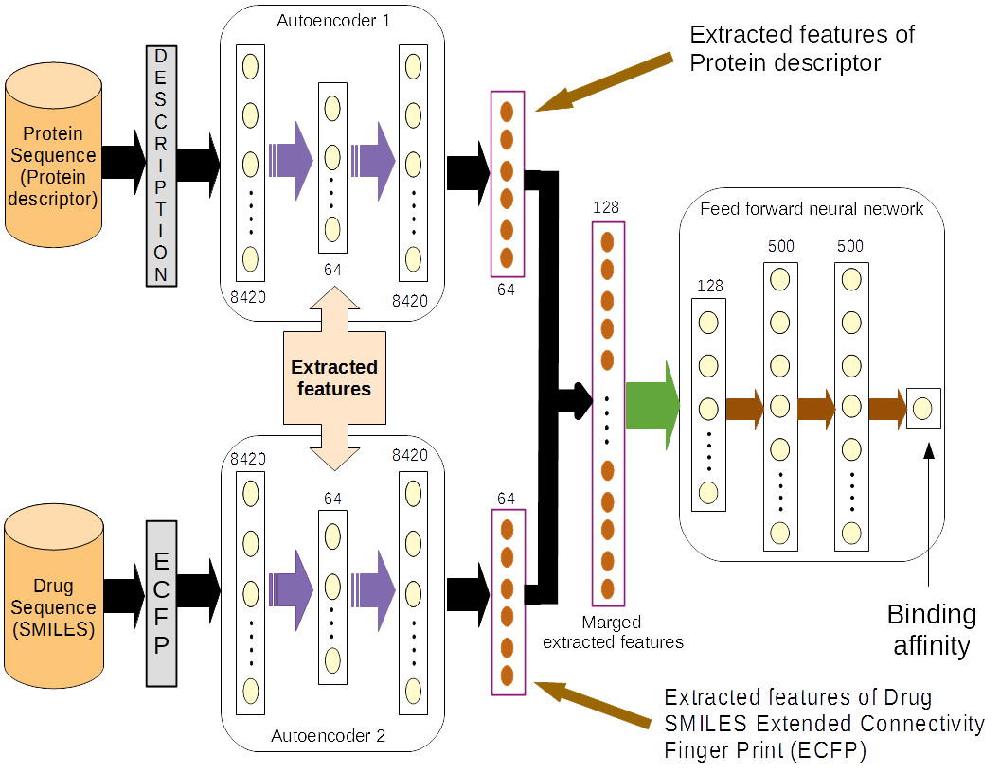

# Prediction of Binding Affinity Among a Set of Publicly Available Drugs and Proteins Coded by SARS-CoV-2

This repository encompasses a set of python codes for prediction of binding affinity between a set of readily available drugs and the proteins coded by SARS-CoV-2. In order to capture the relation between protein sequence and several drugs we have modified the design implemented by a previous work [1]. Here we have considered a pair of SMILE formats of the drugs and protein sequences to train the neural deep neural network model. The training and testing mechanism require conversion of SMILES formats and protein sequences into molecular fingerprints. The fingerprint is a large string of features. In order to minimize the complexity of the training, we have initially incorporated two autoencoders to extract the high-level features. Thereafter, these features have been fed into a feed forward neural network.  The conceptual framework is illustrated in the figure below. 
 

## Software requirement:  
Following are software packages that may be used to generate descriptors for drugs and targets and for the training of machine learning models to predict drug-protein interactions.  

 - Python version: 3.6.10  
 - certifi: 2020.4.5.1  
 - numpy: 1.18.2  
 - pandas: 1.0.3  
 - pip: 20.0.2  
 - python-dateutil: 2.8.1  
 - pytz: 2019.3  
 - setuptools: 46.1.3  
 - six: 1.14.0  
 - sqlite: 3.31.1  
 - vc: 14.1  
 - vs2015_runtime: 14.16.27012  
 - wheel: 0.34.2  
 - wincertstore: 0.2  
 - torch: 1.5.0  
 - The following NVIDIA® software must be installed on your system:  
 - NVIDIA® GPU drivers —CUDA 10.1 requires 418.x or higher.  
 - CUDA® Toolkit —TensorFlow supports CUDA 10.1 (TensorFlow >= 2.1.0)  
 - CUPTI ships with the CUDA Toolkit.  
 - cuDNN SDK (>= 7.6)  
 - (Optional) TensorRT 6.0 to improve latency and throughput for inference on some models.  
  
  
## Hardware Requirement:  
NVIDIA® GPU card with CUDA® Compute Capability 3.5 or higher. See the list of CUDA-enabled GPU cards.  
### Data source:  
 - [DrugBank](https://www.drugbank.ca/)  
 - [Pubchem](https://pubchem.ncbi.nlm.nih.gov/)

### In order to train the deep learning architecture please follow the steps below.  
1.	Train the autoencoder to extract high level features of protein descriptors.  
2.	Train the autoencoder to extract high level features of drug ECFP formats.  
3.	Store and concatenate the extracted features from encoded outputs of both autoencoders.  
4.	Store the encoded concatenated output of the autoencoders to a file with json format.  
5.	Train the feed forward neural network with the json file created in the previous step.  

## Repository structure:  
The repository contains a number of folders. The description about the folders are given below.  
- **1)	Molecular_fingureprint_generation:** This folder contains the python code for conversion of the drug SMILES format and protein sequence into ECFP format and protein descriptor respectively.  
- **2)	Training_testing_data_design:** This folder contains a python code for creating training and testing dataset. Moreover, some json files associated with training and testing of our dataset are attached.  
•	train_data_all_shuffled.json is the training set.  
•	test_set_2.json is the validation/testing set.  
•	NN_input_test_final_COVID_19.json is the testing set with known drug-protein interactions.  
•	NN_input_unknown_binding_evaluate_COVID_19.json is to predict the binding affinity among a number of drugs and a set of proteins coded by SARS-CoV-2.  
- **3)	Protein_Autoencoder_train:** This folder contains the python code for training of the autoencoder in order to extract high level protein descriptor features.
- **4)	Drug_Autoencoder_train:** This folder contains the python code for training of the autoencoder in order to extract high level drug ECFP features.
- **5)	Neural_network_input_design:** This folder contains the python codes for extracting the high level encoded features from both of the autoencoders for designing training as well as testing dataset of the feed forward neural network. 
- **6)	Neural_network_train:** This folder contains the python codes for training and testing of feed forward neural network. In order to test the accuracy of the feed forward neural network, some test data set including dataset of unknown drug-protein interactions have been kept in the folder.
- **7)	Save_models:** This folder contains a python code for saving or loading the deep learning-based model. The folder also contains trained models of autoencoder for extracting deatures of drugs and the feed forward neural network. We are unable to store the autoencoder trained model for extracting deatures of proteins due to limitation of file size as per github.

**Reference:**  
[1] https://github.com/zhanglu-cst/Drug-Target-Interaction

